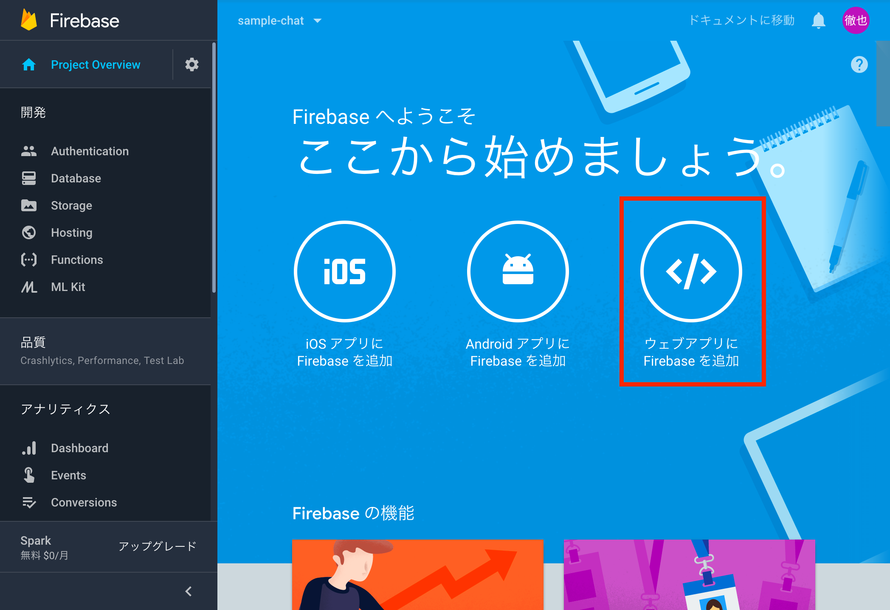
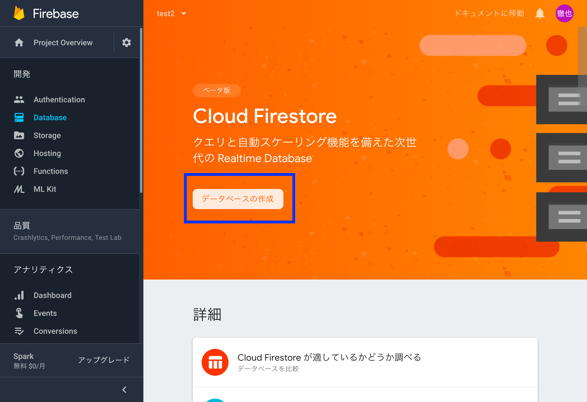
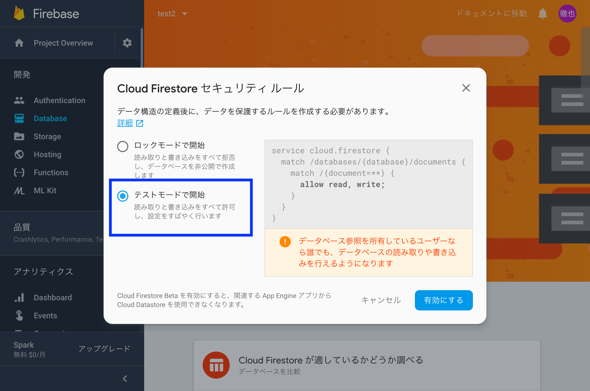

# simple-chat

[【サポーターズ勉強会】リアルタイムデータベース Cloud Firestore入門](https://supporterzcolab.com/event/476/)で使用したサンプルアプリのソースコードです。

## セットアップ

1. 設定ファイルのinit_firebase.jsをサンプルから作成する

```
cd simple-chat
cp init_firebase.sample.js init_firebase.js
```

2. Firebaseのコンソールからconfig用のコードを取得して、init_firebase.jsに記述する。



```
var config = {
  apiKey: "",
  authDomain: "",
  databaseURL: "",
  projectId: "",
  storageBucket: "",
  messagingSenderId: ""
};
firebase.initializeApp(config);
```

3. FirebaseのコンソールのDatabaseからテストモードでFirestoreのデータベースを作成する





4. srcディレクトリ内でWebサーバを立ち上げる

- webサーバを立ち上げるにはhttp-serverを使うのがおすすめ

```
npm install -g http-server
cd src
http-server
```
